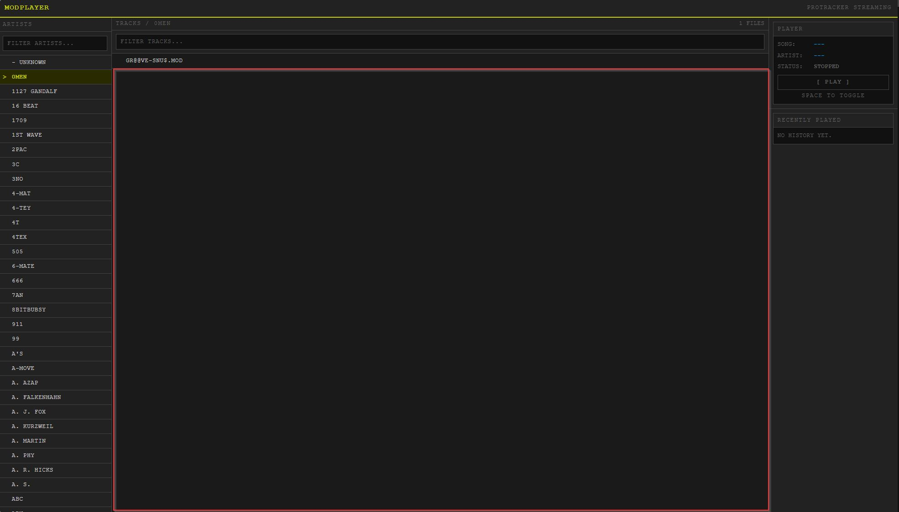

# Modplayer

A web-based MOD music player with a retro tracker aesthetic. It browses and
streams ProTracker `.mod` files directly from
[modland.com](https://modland.com/pub/modules/Protracker/), decodes them in the
browser via an `AudioWorklet`, and renders a real-time spectrum visualizer.



## Features

- **Artist browser** — the full ProTracker artist index from modland.com, with a live filter.
- **Track list** — `.mod` files for the selected artist, filterable by name.
- **Playback** — click a track to stream and play it; play/pause toggle in the player panel.
- **Spacebar or right-click to toggle** — pause/resume from anywhere; spacebar ignores text inputs and key repeat.
- **Load a local file** — play a `.mod` from your own machine via `[ LOAD .MOD FILE ]` in the header.
- **Download** — save any `.mod` locally from the download icon in the track list, recently played, and favourites.
- **Recently played** — the last 3 tracks, click to replay.
- **Favourites** — star up to 5 tracks; persisted to `localStorage`.
- **Volume** — vertical slider fixed bottom-right; drag it or scroll the wheel over it. Persisted.
- **Spectrum visualizer** — 4 chunky bars (green → yellow → red) centered along the bottom, driven by a Web Audio `AnalyserNode`. Fades to a flat baseline when idle.
- **Retro UI** — green-on-dark monospace theme over a 16-bit nostalgia backdrop, with the current track scrolling across the header.

## Tech stack

- **React 18 + TypeScript** — UI and type safety
- **Vite** — dev server (HMR) and build tool
- **Tailwind CSS** — utility-first styling (custom `retro` color palette)
- **chiptune3** — wraps `libopenmpt` via `AudioWorklet` for MOD synthesis
- **Web Audio API** — playback graph and frequency analysis
- **TanStack Query** — caches modland directory listings
- **Zustand** — client-side playback state (current track, status, history)
- **Axios** — fetches directory listings (parsed from HTML with `DOMParser`)

## Getting started

```bash
npm install
npm run dev
```

Open the URL Vite prints (default http://localhost:5173).

> Requires a modern browser with Web Audio API and `AudioWorklet` support.

## Scripts

| Script            | Description                                              |
| ----------------- | -------------------------------------------------------- |
| `npm run dev`     | Start the Vite dev server with HMR                       |
| `npm run build`   | Type-check (`tsc -b`) and build to `dist/`               |
| `npm run preview` | Preview the production build locally (served under `/modplayer/`) |

## Deployment

modland.com sends `Access-Control-Allow-Origin: *`, so the browser fetches it
directly and no proxy is needed. That lets the app run as a static site.

It deploys to GitHub Pages via `.github/workflows/deploy.yml` on every push to
`main`. Because the site lives at a sub-path, `vite.config.ts` sets
`base: '/modplayer/'` for production builds only, so `npm run dev` stays at the
root URL. Runtime asset paths (the worklet, background image) use
`import.meta.env.BASE_URL` for the same reason.

## Project structure

```
public/
  chiptune3.worklet.js      # AudioWorklet glue (served at runtime)
  libopenmpt.worklet.js     # libopenmpt MOD decoder worklet
src/
  modland.ts                # modland base URL + track URL builder
  audio/audioEngine.ts      # Web Audio graph, playback, AnalyserNode for the visualizer
  hooks/useModland.ts       # TanStack Query hooks: useCreators(), useTracks()
  store/playback.ts         # Zustand store: current track, isPlaying, history, favourites, volume
  components/
    SearchBar.tsx           # Filter input
    TrackList.tsx           # Track rows for the selected artist
    Player.tsx              # Player panel + spacebar and right-click handlers
    TrackHistory.tsx        # Recently played list
    Favourites.tsx          # Starred tracks list
    DownloadLink.tsx        # Download icon (fetches to a blob; cross-origin safe)
    LoadFile.tsx            # Load a .mod from the local machine
    VolumeSlider.tsx        # Vertical volume slider (drag or wheel)
    SpectrumBars.tsx        # Canvas spectrum visualizer
  App.tsx                   # Layout: artists | tracks | player
  index.css                 # Tailwind layers + base theme
```

## How it works

1. `useCreators()` fetches the ProTracker index page and `useTracks(artist)`
   fetches an artist's folder; both parse the HTML directory listing into names
   and are cached by TanStack Query.
2. Selecting a track calls `loadMod(url)` in `audioEngine.ts`, which fetches the
   file and feeds it to the `libopenmpt` `AudioWorklet`:
   `worklet → gain → analyser → destination`.
3. `SpectrumBars` reads `getByteFrequencyData()` from the analyser each frame and
   draws the bars; with no audio the levels decay to a flat baseline.

## Credits

MOD files are streamed from [modland.com](https://modland.com). Playback is
powered by [libopenmpt](https://lib.openmpt.org/) via
[chiptune3](https://github.com/deskjet/chiptune2.js).
